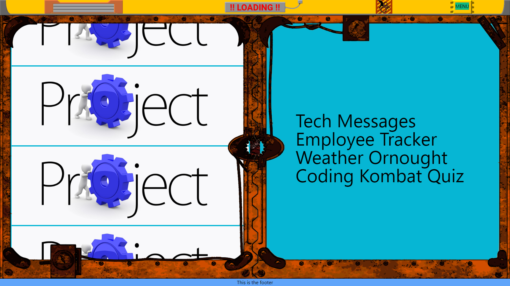

# A Portfolio Made with React and Framer-motion

## whoami 

Welcome to my portfolio! I've had my finger tips on keyboards since I was first introduced to the Commadore 64 as a child. Since then I've worked several years in Cyber Security, attended multiple college classes covering various programming languages finializing with a Computer Science degree, written numerous Python scripts for personal projects/tasks, created countless partial games utilizing Unity3D, and recently completed a 6-mth Full Stack Web Developer course. If it's not obvious yet, my heart has never been in Cyber Security - I prefer the rollercoaster ride of working through coding projects. I'm also a bit of a wanna-be artist - I've taught myself basic usage of GIMP for texturing, and sprite creation and Blender for 3D box-modeling/sculpting, rigging, and animating.
  
## Table of Contents

* [Description](#description)
* [Lessons Learned](#lessons-learned)
* [Installation](#installation)
* [Usage](#usage)
* [Contribution](#contribution)
* [Testing](#testing)
* [Questions](#questions)
* [Licensing](#licensing)

## Description

That's cool but - what's up with this portfolio?
A portfolio is a developers greatest tool for sharing projects and displaying their skillset to potential employers or clients. First impressions are lasting and set the tone so the portfolio shouldn't just be a path to your projects but also an extension of you and your creativity. With this project I set out to create something that doesn't reseamble a typical web site.

Being my first React project I wanted to keep additional libraries to a minimum so more focus could be applied to learning React. However, I also wanted to attempt to give the site a 3D feel without using the HTML Canvas to manipulate 3D objects. This meant layer depths were artificial and required 'smoke and mirrors' to achieve a 3D effect. Animations were initially performed in CSS but I quickly switched to using Framer-motion since the CSS was becoming bloated and animations were too cumbersome to tweak. The end-result, in my opinion, gives the site a very unique feel.

Deployed Project: SOON!
   
 

## Lessons Learned

What did I learn from this project?
The absolute greatest lesson I learned from this project is... MOBILE FIRST! I knew the concept going in but didn't give it any thought until too late.
Second greatest lesson... SCOPE! Don't let your kids control your scope with "you know what would be cool."
Not to diminish the importance of those two lessons but I did learn a great deal about React and Framer-motion animations. I also discovered that building site visuals with mostly absolute positioned PNGs makes styling increadiably difficult - BUT I am much more comfortable with the process now.

## Installation
You'll need [Node.js](https://nodejs.org/) and [React](https://www.npmjs.com/package/react)

Then:
-  start:   "npm run start"
-  build:   "npm run build"

## Usage

The site consists of 4 routes - all accessiable from the drop-down menu in the top right.
The Projects page has a series of buttons to click to display basic project information and external links.
The Contact page has a 'terminal' that is powered on with the right-most large dial. The screen prompts the user for Name, Email and Message.

## Contribution

Follow the "fork-and-pull" Git workflow.

  1. **Fork** the repo on GitHub
  2. **Clone** the project to your own machine
  3. **Commit** changes to your own branch
  4. **Push** your work back up to your fork
  5. Submit a **Pull request** so that we can review your changes

NOTE: Be sure to merge the latest from "upstream" before making a pull request!

## Testing
  
N/A

## Questions

Feel free to contact me with any questions or comments:  
<donovan.courtney@gmail.com>  
<https://github.com/decourtney>

## Licensing

Code and Docs released under [MIT License](https://choosealicense.com/licenses/mit/).
