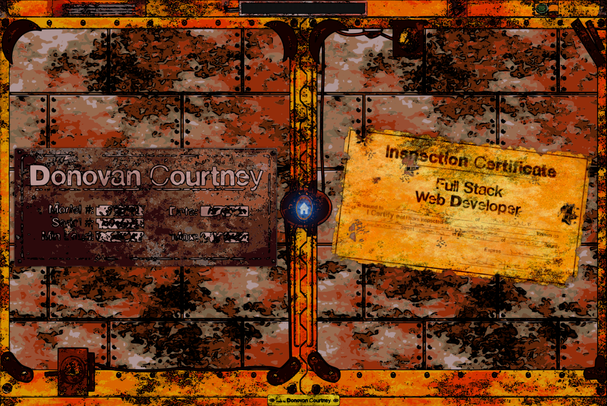

# React Portfolio

  
## Table of Contents

* [Description](#description)
* [Installation](#installation)
* [Usage](#usage)
* [Contribution](#contribution)
* [Testing](#testing)
* [Questions](#questions)
* [Licensing](#licensing)

## Description

This is my portfolio site, built using React and TypeScript. As my first React project, I'm excited to showcase my development skills and my own unique art style through this website.

The site is currently under construction, but I'm working hard to make it as visually appealing and functional as possible. I'm using custom artwork and graphics to create a distinct and memorable visual identity for the site.

Through this portfolio, I hope to highlight my skills and experience as a developer, as well as demonstrate my creative abilities. I'm excited to continue working on this project and share my progress as I bring my vision to life.

Deployed Project: https://still-sea-34126.herokuapp.com/
   
 

## Installation

You'll need [Node.js](https://nodejs.org/) and [React](https://www.npmjs.com/package/react)

Then:
-  start:   node server/server.js,
-  develop: "concurrently \"cd server && npm run watch\" \"cd client && npm start\"",
-  install: "cd server && npm i && cd ../client && npm i",
-  seed:    "cd server && npm run seed",
-  build:   "cd client && npm run build"

## Usage

The site is still under heavy construction and currently has basic information.
- Home gives a basic instroduction
- About provides a high level view of my goals and aspirations
- Projects displays a clickable list of my recent or noteworthy projects that expand to more details
- Contact provides a means of dropping me an email

## Contribution

Follow the "fork-and-pull" Git workflow.

  1. **Fork** the repo on GitHub
  2. **Clone** the project to your own machine
  3. **Commit** changes to your own branch
  4. **Push** your work back up to your fork
  5. Submit a **Pull request** so that we can review your changes

NOTE: Be sure to merge the latest from "upstream" before making a pull request!

## Testing
  
N/A

## Questions

Feel free to contact me with any questions or comments:  
<donovan.courtney@gmail.com>  
<https://github.com/decourtney>

## Licensing

Code and Docs released under [MIT License](https://choosealicense.com/licenses/mit/).
